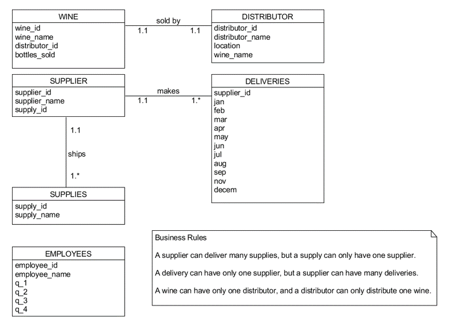
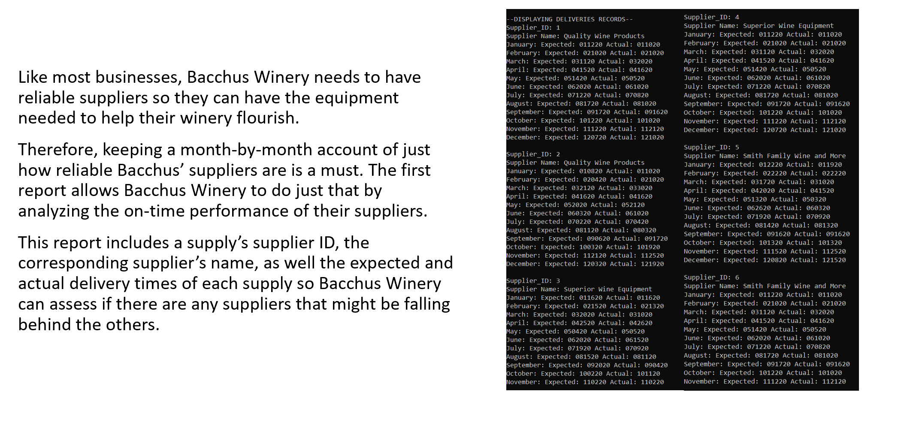
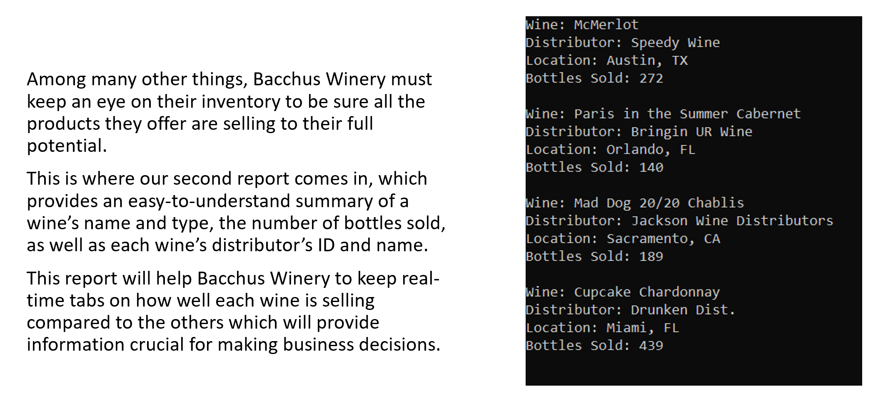
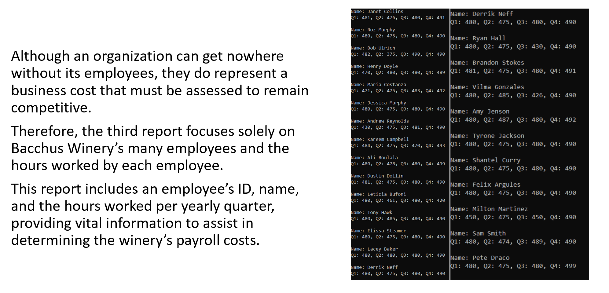

# BacchusWinery

## Table of Contents
1. [Database Screen Shots](#database-screen-shots)
2. [Database Description](#database-description)
3. [Technologies Used](#technologies-used)
4. [Developer Information](#developer-information)

## Database Screen Shots

Report #1: Supplier Delivery                    |  Report #2: Wine Sales                |  Report #3: Employee Time
:-------------------------:|:-------------------------:|:-------------------------:
  |   | 

[Back to Table of Contents](#table-of-contents)

### Database Description

BacchusWinery is a database built by a five-person team in a mock agile SDLC environment for a faux client named Bacchus Winery.
The database was constructed with the intent of making reports comprised of the stored data available to the winery based on its communicated business needs. 
This normalized, MongoDB database features SQL CRUD operations and join creations via Python cursor.

[Back to Table of Contents](#table-of-contents)

### Technologies Used

- Python
- Python cursor for SQL statements
- MongoDB
- Visual Studio Code IDE
- UMLet for ORD

[Back to Table of Contents](#table-of-contents)

## Developer Information
Designed and built by Andrew B. Schaefer [(Ab0213ab)](https://github.com/Ab0213ab) in tandem with:
- Caleb Mastromonaco [(CMastro)](https://github.com/CMastrom)
- Jennifer Thomas (GitHub unknown)
- Milo Blake (GitHub unknown)
- Shane Fox (GitHub unknown)

LinkedIn: https://www.linkedin.com/in/andrewbschaefer/

Email: Abs233abs@gmail.com 

[Back to Table of Contents](#table-of-contents)

